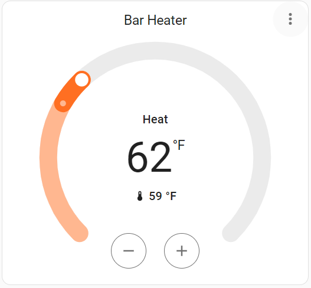

# Envi Smart Heater Integration for Home Assistant

[](https://github.com/hacs/integration)

> **⚠️ DISCLAIMER**: This is an **UNOFFICIAL** integration. This integration is not created, maintained, or endorsed by EHEAT, Inc. or Envi. It uses the Envi API in an unofficial capacity. Use at your own risk.

A comprehensive Home Assistant integration for Envi Smart Heaters with enhanced reliability, error handling, and advanced features.



## Features

- **Climate Control**: Full temperature control (50°F - 86°F) and on/off functionality
- **Sensor Platform**: 10 diagnostic sensors per device (signal strength, firmware, mode, schedule info, WiFi, location, model, serial, last update)
- **Binary Sensor Platform**: 5 binary sensors per device (freeze protect, child lock, schedule active, hold, online)
- **DataUpdateCoordinator**: Efficient parallel updates for all devices
- **Temperature Conversion**: Automatic Celsius/Fahrenheit conversion support
- **Custom Services**: Advanced functionality for scheduling and status monitoring
- **Robust Error Handling**: Graceful degradation and detailed error reporting

## Installation

### HACS (Recommended)

1. Open HACS in Home Assistant
2. Go to Integrations
3. Click the three dots menu → Custom repositories
4. Add this repository URL
5. Search for "Envi Smart Heater" and install
6. Restart Home Assistant

### Manual Installation

1. Copy the `custom_components/smart_envi` folder to your `custom_components` directory
2. Restart Home Assistant
3. Add the integration via Settings → Devices & Services → Add Integration

## Configuration

1. Go to Settings → Devices & Services
2. Click "Add Integration"
3. Search for "Envi Smart Heater"
4. Enter your Envi account credentials
5. The integration will automatically discover your heaters and create all entities

## What Gets Created

For each Envi heater, the integration creates:
- **1 Climate Entity**: Temperature control and on/off
- **10 Sensor Entities**: Signal strength, firmware version, mode, schedule name/temperature, WiFi SSID, location, model, serial number, last update
- **5 Binary Sensor Entities**: Freeze protection, child lock, schedule active, hold, online status

## Usage

### Basic Climate Control

Control your heaters through the climate entities:
- Set target temperature
- Turn heaters on/off
- View current ambient temperature

### Custom Services

- `smart_envi.refresh_all`: Refresh all heaters
- `smart_envi.get_status`: Get detailed device status
- `smart_envi.set_schedule`: Set heating schedules
- `smart_envi.test_connection`: Test API connection

See the [full documentation](custom_components/smart_envi/README.md) for detailed usage examples.

## Requirements

- Home Assistant 2023.1 or later
- Envi account with active heaters
- Internet connection

## Limitations

Some device settings (freeze protect, child lock, hold) cannot be changed via the API and must be configured through the Envi mobile app.

## Troubleshooting

Enable debug logging:

```yaml
logger:
  logs:
    custom_components.smart_envi: debug
```

See the [troubleshooting guide](custom_components/smart_envi/README.md#troubleshooting) for common issues.

## Contributing

Issues and pull requests are welcome! Please check existing issues before creating a new one.

## License

This project is licensed under the MIT License.

## ⚠️ Disclaimer

This is an **UNOFFICIAL** integration. This integration is:
- **NOT** created, maintained, or endorsed by EHEAT, Inc. or Envi
- **NOT** an official Home Assistant integration
- Uses the Envi API in an **unofficial capacity**
- Provided "as-is" without warranty
- May stop working if EHEAT changes their API

Use at your own risk. The developers are not responsible for any issues that may arise from using this integration.

## Credits

- **Original Author**: [@wlatic](https://github.com/wlatic) - Initial Envi Heater integration
- Integration enhanced and maintained for the Home Assistant community
- **Manufacturer**: [EHEAT, Inc.](https://www.eheat.com/) - Envi Smart Heaters
- Uses the Envi API for device communication (unofficial use)
